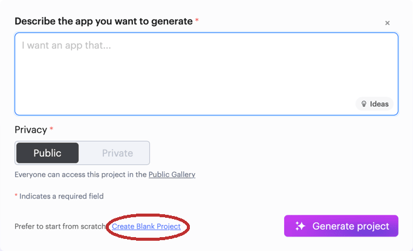
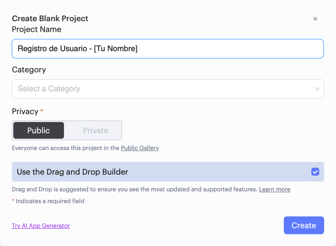
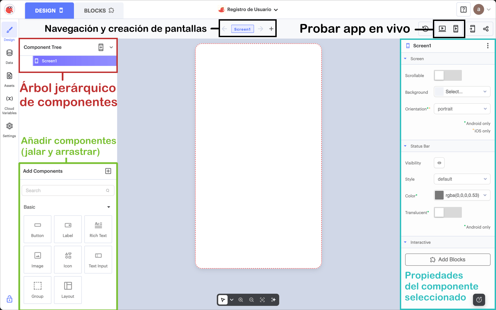
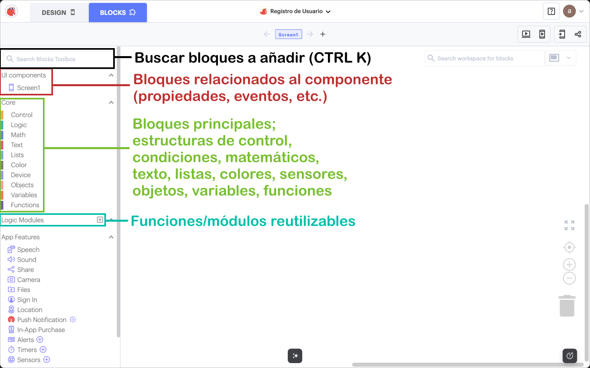
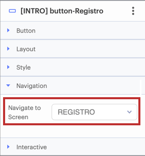
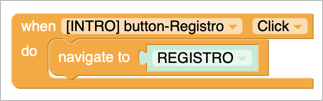
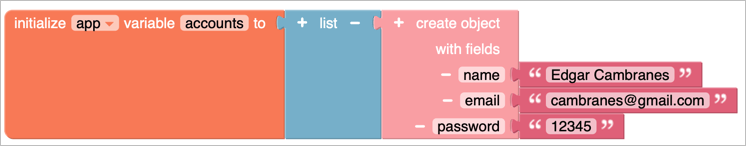
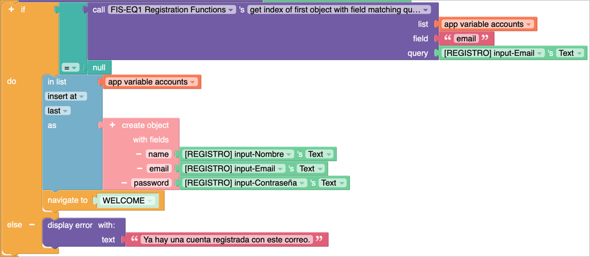

# Desarrollo de Aplicaciones Móviles en Thunkable

Este repositorio contiene instrucciones para la implementación de un caso de uso utilizando [Thunkable](https://www.thunkable.com), una plataforma de desarrollo de aplicaciones móviles sin código.

## 🎯 Meta a Implementar

### **Caso de uso 1: Proporcionar un método de registro (correo/contraseña)**
**Actor:** Usuario nuevo  
**Descripción:** El usuario crea una cuenta proporcionando sus datos básicos para acceder a la aplicación.

**Flujo principal:**
1. El usuario selecciona la opción "Registrarse"
2. Ingresa nombre, correo y contraseña
3. El sistema valida los datos
4. El sistema crea la cuenta y muestra un mensaje de bienvenida

**Flujo alterno:**
Si el correo ya está registrado, el sistema muestra un mensaje indicando que debe iniciar sesión.

---

## 🛠️ Configuración Inicial

### 1. Crear cuenta en Thunkable
- Visita [thunkable.com/signup](https://thunkable.com/signup)
- Haz clic en `Sign up with Google`
-  * Si te  pregunta el motivo por cual usarás Thunkable, selecciona las opciones que consideres adecuadas.

### 2. Crear proyecto
- Visita [x.thunkable.com/projects](https://x.thunkable.com/projects)
- En el apartado de `Describe the app you want to generate`...
- ...Selecciona el hipervínculo `Create Blank Project`



- Nombra el proyecto `Registro de Usuario - [Tu Nombre]`
- Dale clic a `Create`



---

## 🎨 Diseño de la Interfaz



### ❗️ Obligatorios

El diseño de la aplicación es libre, pero se requiere el uso de mínimo 2 pantallas y los siguientes componentes en cada uno:

#### Pantalla 1: Intro

```
- Button (Registrar cuenta) -> Pantalla 2
```

#### Pantalla 2: Registro

```
- Text Input (Nombre)
- Text Input (Email)
- Text Input (Contraseña)
- Button (Registrar cuenta) -> Validar datos -> Crear cuenta -> Bienvenida
```

---

### ❓ Opcionales

Adicionalmente, se sugiere el uso de los siguientes:

#### Pantalla 1: Intro

```
- Label (Título de la aplicación)
- Image/Icon (Logo de la aplicación)
- Button (Iniciar sesión)
```

#### Pantalla 2: Registro

```
- Label/Rich Text (Mensaje de error)
```

#### Pantalla 3: Bienvenida

```
- Label (Título de la aplicación)
- Image/Icon (Logo de la aplicación)
- Label/Rich Text (Mensaje de bienvenida)
```

---

Posteriormente, se sugiere nombrar los componentes con el siguiente formato: `[PANTALLA] tipo-Propósito`

e.g. `[REGISTRO] button-RegistrarCuenta`

---

## ⚙️ Lógica de Programación



Se solicita que el botón `[INICIO] button-Registro` navegue a la pantalla 2.

**Hay dos formas para lograr esto:**
1. Cambiando la propiedad `Navigate to Screen`:



2. En `BLOCKS` -> `INTRO`, programando un evento al hacer click:



### Variables
- `accounts` (lista con 1+ objeto) simular base de datos; checar si ya existe un correo


### `[REGISTRO] button-RegistrarCuenta`

- Al hacer clic en el botón, el sistema debe validar los datos:
  - Si el correo **ya está registrado**, deberá mostrar un mensaje de error.
  - Si el correo **no está registrado**, podrá crear la cuenta.

Para este apartado, se sugiere utilizar un módulo lógico con un set de funciones útiles:

```
https://x.thunkable.com/module/6928d634e9c76478c8119dd8/
```


**Algoritmo empleado:**



---

## 🧪 Pruebas y Validación

Usando el botón de `Web Preview` o `Live Test` (si tienes la aplicación de Thunkable en tu celular), se sugiere que pruebes los siguientes casos:

### Casos a verificar:
1. ❗️ **Email nuevo**
2. ❗️ **Email duplicado/existente**
3. ❓ Email inválido (opcional)
4. ❓ Campos vacíos (opcional)

---

## 📚 Recursos Adicionales

- [Proyecto de Referencia](https://x.thunkable.com/projects/6927db266bf3e34d5093b0db/03e2c4fd-add6-450b-bff7-47e2ccc183a8/designer)

### Documentación oficial:
- [Thunkable Docs](https://docs.thunkable.com/)
- [Video Tutoriales](https://www.youtube.com/c/Thunkable)